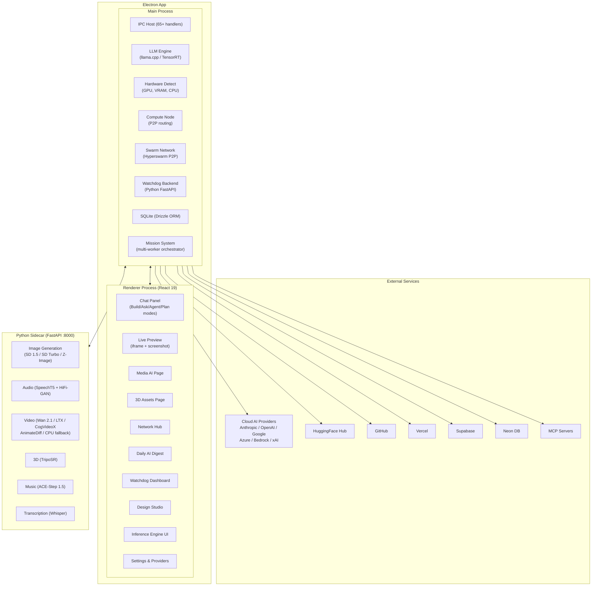
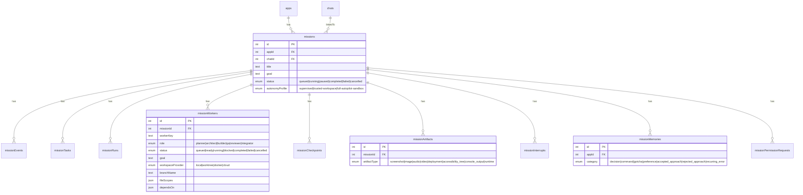

# OrianBuilder — Deep Project Analysis

> **Version**: 0.44.0 · **Author**: srideep / Legion Studios  
> **License**: Apache 2.0 (open) + FSL 1.1 (`src/pro/`)  
> **Stack**: Electron 40 · React 19 · TypeScript · SQLite (Drizzle ORM) · Vercel AI SDK · Python sidecars

---

## 1. High-Level Architecture



---

## 2. Core Platform — Electron IPC Boundary

The app follows a **strict main ↔ renderer IPC boundary** with 65+ handler files in [src/ipc/handlers/](file:///c:/Work/legionStudio/OrianBuilder/src/ipc/handlers).

### Key Handler Groups

| Handler File | Purpose |
|---|---|
| [mission_handlers.ts](file:///c:/Work/legionStudio/OrianBuilder/src/ipc/handlers/mission_handlers.ts) | Multi-worker mission orchestration (1312 lines) |
| [github_handlers.ts](file:///c:/Work/legionStudio/OrianBuilder/src/ipc/handlers/github_handlers.ts) | Full GitHub integration (54K) |
| [embedded_model_handler.ts](file:///c:/Work/legionStudio/OrianBuilder/src/ipc/handlers/embedded_model_handler.ts) | Local model loading/serving |
| [design_studio_handler.ts](file:///c:/Work/legionStudio/OrianBuilder/src/ipc/handlers/design_studio_handler.ts) | Design Studio AI sessions |
| [image_generation_handlers.ts](file:///c:/Work/legionStudio/OrianBuilder/src/ipc/handlers/image_generation_handlers.ts) | AI image generation |
| [media_ai_handlers.ts](file:///c:/Work/legionStudio/OrianBuilder/src/ipc/handlers/media_ai_handlers.ts) | Media AI backend lifecycle |
| [network_handlers.ts](file:///c:/Work/legionStudio/OrianBuilder/src/ipc/handlers/network_handlers.ts) | P2P network operations |
| [watchdog_handlers.ts](file:///c:/Work/legionStudio/OrianBuilder/src/ipc/handlers/watchdog_handlers.ts) | Website/price tracker |
| [vercel_handlers.ts](file:///c:/Work/legionStudio/OrianBuilder/src/ipc/handlers/vercel_handlers.ts) | Vercel deployment |
| [neon_handlers.ts](file:///c:/Work/legionStudio/OrianBuilder/src/ipc/handlers/neon_handlers.ts) | Neon database management |
| [supabase_handlers.ts](file:///c:/Work/legionStudio/OrianBuilder/src/ipc/handlers/supabase_handlers.ts) | Supabase integration |

### IPC Contract System

Contracts are defined in [src/ipc/contracts/](file:///c:/Work/legionStudio/OrianBuilder/src/ipc/contracts) and types in [src/ipc/types/](file:///c:/Work/legionStudio/OrianBuilder/src/ipc/types). Each handler uses `createLoggedTypedHandler` for type-safe, logged IPC communication.

---

## 3. AI Inference Engine (In-App)

### 3.1 Local Inference — llama.cpp

Located in [src/main/llm/](file:///c:/Work/legionStudio/OrianBuilder/src/main/llm):

| File | Purpose |
|---|---|
| [llama_server_backend.ts](file:///c:/Work/legionStudio/OrianBuilder/src/main/llm/llama_server_backend.ts) | Manages llama.cpp server process |
| [llama_server_args.ts](file:///c:/Work/legionStudio/OrianBuilder/src/main/llm/llama_server_args.ts) | CLI argument builder (VRAM, layers, context) |
| [llama_server_binary.ts](file:///c:/Work/legionStudio/OrianBuilder/src/main/llm/llama_server_binary.ts) | Binary download and management |
| [llama_server_downloader.ts](file:///c:/Work/legionStudio/OrianBuilder/src/main/llm/llama_server_downloader.ts) | GGUF model downloader from HuggingFace |
| [llama_server_stats_poller.ts](file:///c:/Work/legionStudio/OrianBuilder/src/main/llm/llama_server_stats_poller.ts) | Real-time inference stats (tok/s, VRAM, GPU temp) |
| [backend_resolver.ts](file:///c:/Work/legionStudio/OrianBuilder/src/main/llm/backend_resolver.ts) | Resolves which backend to use |

**Key Features:**
- GGUF-format model support
- Smart VRAM management with automatic GPU-layer detection
- Flash Attention & context tuning (context size, batch size, temperature, top-p/k, repeat penalty)
- Full tool calling support for agentic workflows
- HuggingFace marketplace browsing directly in-app

### 3.2 NVIDIA TensorRT Acceleration

Located in [native/](file:///c:/Work/legionStudio/OrianBuilder/native):

| Directory | Purpose |
|---|---|
| [native/tensorrt-runner/](file:///c:/Work/legionStudio/OrianBuilder/native/tensorrt-runner) | TensorRT plan-based runner |
| [native/trt-llm-runner/](file:///c:/Work/legionStudio/OrianBuilder/native/trt-llm-runner) | TensorRT-LLM Python sidecar (runner.py) |

- One-click engine build (HF download → ONNX export → trtexec compile)
- fp16/fp32 precision selection
- Streaming token generation
- Supported: Qwen2.5 series (0.5B → 7B Instruct), extensible

### 3.3 Cloud AI Providers

Via [Vercel AI SDK](file:///c:/Work/legionStudio/OrianBuilder/package.json#L92) (`ai@^6.0.68`):

| Provider | Package |
|---|---|
| Anthropic (Claude) | `@ai-sdk/anthropic` |
| OpenAI (GPT-4, o1/o3/o4) | `@ai-sdk/openai` |
| Google (Gemini) | `@ai-sdk/google` |
| Google Vertex | `@ai-sdk/google-vertex` |
| Azure OpenAI | `@ai-sdk/azure` |
| Amazon Bedrock | `@ai-sdk/amazon-bedrock` |
| xAI (Grok) | `@ai-sdk/xai` |
| OpenAI-compatible (custom) | `@ai-sdk/openai-compatible` |
| Local (Ollama / LM Studio) | Custom handlers |
| MCP Protocol | `@ai-sdk/mcp` + `@modelcontextprotocol/sdk` |

---

## 4. Agentic System — Chat Modes & Prompts

### 4.1 Chat Modes

Defined in [system_prompt.ts](file:///c:/Work/legionStudio/OrianBuilder/src/prompts/system_prompt.ts) and [local_agent_prompt.ts](file:///c:/Work/legionStudio/OrianBuilder/src/prompts/local_agent_prompt.ts):

| Mode | Description |
|---|---|
| **Build** | Writes code via `<orianbuilder-write>` tags, creates/modifies files |
| **Ask** | Read-only explanations, NO code generation |
| **Local Agent (Pro)** | Full tool-calling agent with `search_replace`, `write_file`, `edit_ast`, `take_screenshot`, `deploy_preview`, etc. |
| **Local Agent (Basic)** | Free-tier agent with limited tools (no `code_search`, `web_search`, `web_crawl`) |
| **Plan** | Agent drafts a plan before executing |
| **Autopilot** | Full autonomous end-to-end execution from a single prompt — no questions asked |

### 4.2 Agent Tool System

The local agent has a rich set of tools including:
- `read_file`, `write_file`, `search_replace`, `edit_ast` (TypeScript AST operations)
- `grep`, `list_files`, `get_repo_map`, `code_search`
- `start_dev_server`, `run_type_checks`, `run_terminal_command`
- `take_screenshot`, `get_accessibility_tree`, `read_console_output`
- `generate_image`, `copy_file`
- `deploy_preview`, `connect_github_repo`, `connect_vercel_project`
- `create_project`, `verify_project`, `detect_project_stack`
- `browser_qa_gate`, `package_native_artifact` (Android APK / Electron installer)
- `planning_questionnaire`, `update_todos`, `set_chat_summary`

### 4.3 Autopilot Mode

The [AUTOPILOT_DIRECTIVE_BLOCK](file:///c:/Work/legionStudio/OrianBuilder/src/prompts/local_agent_prompt.ts#L309-L342) transforms the agent into a fully autonomous builder:

- **Zero questions** — makes decisions and documents them
- **Stack auto-classification**: `vite-react-ts`, `nextjs-ts`, `expo`, `electron-app`, `node-express-ts`
- **Self-correction loop**: detect → scaffold → implement → verify → fix → repeat
- **Visual verification mandatory** for UI work (desktop + mobile screenshots)
- **Auto-delivery**: GitHub repo → Vercel deploy → PR creation → download URL

---

## 5. Mission System — Multi-Worker Orchestration

> [!IMPORTANT]
> This is the most sophisticated subsystem — an **autonomous multi-agent orchestrator** with parallel workers, dependency graphs, and auto-recovery.

### 5.1 Database Schema (from [schema.ts](file:///c:/Work/legionStudio/OrianBuilder/src/db/schema.ts#L126-L422))



### 5.2 Worker Lifecycle

Workers go through: `queued → ready → running → completed/failed/blocked`

Key features:
- **Parallel execution** with configurable parallelism (`DEFAULT_MAX_PARALLEL_WORKERS`)
- **Dependency graphs** — workers can `dependsOn` other workers
- **Stale detection** — workers that run too long are marked stale with interrupts
- **Workspace isolation** via git worktrees, Docker, or cloud providers
- **Auto-advance scheduler** — automatically dispatches ready workers when dependencies are satisfied
- **Auto-resume** — missions resume after app restart
- **Worker reports** — structured completion reports with changed files, validation, blockers, artifacts
- **Integration status** — tracks whether worker output has been merged into main
- **Permission requests** — risk-assessed permission system (low/medium/high)
- **Mission memories** — cross-mission learning (decisions, gotchas, recurring errors)

### 5.3 Worker Roles

| Role | Purpose |
|---|---|
| `planner` | Decomposes the mission goal into tasks |
| `architect` | Designs the technical approach |
| `builder` | Implements the code changes |
| `qa` | Tests and validates the implementation |
| `reviewer` | Reviews code for quality and correctness |
| `integrator` | Merges worker outputs into the main branch |

---

## 6. Media Generation Pipeline

### 6.1 Python Backend (FastAPI on :8000)

Located in [mediaai-backend/](file:///c:/Work/legionStudio/OrianBuilder/mediaai-backend):

```
FastAPI Backend (main.py)
    ↓
Routes Layer (routes/generation.py)
    ↓
Services Layer (services/*.py)
    ├─ text_generation.py (llama-cpp-python + Phi-3)
    ├─ image_generation.py (ONNX/DirectML + Stable Diffusion)
    ├─ audio_generation.py (SpeechT5 + HiFi-GAN)
    ├─ video_generation.py (diffusers + text-to-video models)
    ├─ music_generation.py (ACE-Step 1.5)
    └─ threed.py (TripoSR + image-to-3D)
```

Multi-backend support via separate requirements files:
- `requirements-cuda.txt` (NVIDIA)
- `requirements-rocm.txt` (AMD)
- `requirements-mps.txt` (Apple Silicon)
- `requirements-directml.txt` (Windows AMD/Intel)
- `requirements-openvino.txt` (Intel)
- `requirements-cpu.txt` (Fallback)

### 6.2 Image Generation

The [Media AI page](file:///c:/Work/legionStudio/OrianBuilder/src/pages/mediaai.tsx) (5141 lines!) supports multiple tiers:

| Tier | Model | VRAM | Speed |
|---|---|---|---|
| SD Turbo | Stability AI SD Turbo | ~4 GB | Very fast |
| Z-Image Turbo | Z-Image Turbo | ~6 GB | Fast |
| SD 1.5 ONNX | Stable Diffusion 1.5 | ~4 GB | Medium |
| Cloud (Pollinations) | Flux (free API) | 0 | Fast (cloud) |

Features: width/height/steps/guidance/seed/negative-prompt controls, per-tier persisted settings.

### 6.3 Audio Generation

- **Model**: Microsoft SpeechT5 TTS + HiFi-GAN vocoder
- **Output**: 22kHz WAV
- **Performance**: 3-8 sec on CPU
- **Design**: CPU-only to preserve GPU VRAM

### 6.4 Video Generation

Multiple tiers (from [mediaai.tsx](file:///c:/Work/legionStudio/OrianBuilder/src/pages/mediaai.tsx#L131-L144)):

| Tier | Model | VRAM | Download |
|---|---|---|---|
| Wan 2.1 14B | Alibaba Wan 2.1 | 14+ GB | ~30 GB |
| LTX Video | Lightricks LTX | ~10 GB | ~18 GB |
| Wan 2.1 1.3B | Budget Wan 2.1 | 5 GB | ~14 GB |
| CogVideoX 2B | THUDM CogVideoX | 7 GB | ~11 GB |
| AnimateDiff SD15 | AnimateDiff | 4 GB | ~6 GB |
| CPU fallback | MS 1.7B | 0 | ~8 GB |

### 6.5 Music Generation

- **Model**: ACE-Step 1.5 Turbo (4 GB) and XL Turbo (12 GB)
- **Features**: Full songs with vocals + instruments, lyrics planner (0.6B LM), inference step control, CoT lyrics mode
- **Future**: YuE 7B, DiffRhythm integration planned

### 6.6 3D Model Generation

Located in [threedassets.tsx](file:///c:/Work/legionStudio/OrianBuilder/src/pages/threedassets.tsx):

- **Model**: TripoSR (Stability AI) — image-to-3D reconstruction in ~1 second on 6GB GPU
- **Pipeline**: Text prompt → image generation (Z-Image Turbo) → TripoSR mesh reconstruction → GLB export
- **Viewer**: React Three Fiber + Drei with orbit controls, auto-rotate, multiple lights
- **Controls**: Mesh resolution (256/320/384/512), foreground ratio, text or image input
- **Output**: GLB format with download button

### 6.7 Transcription

- **Model**: Whisper Base
- **Size**: ~150 MB download

---

## 7. P2P Compute Network

### 7.1 Network Layer (Main Process)

Located in [src/main/network/](file:///c:/Work/legionStudio/OrianBuilder/src/main/network):

| File | Purpose |
|---|---|
| [swarm.ts](file:///c:/Work/legionStudio/OrianBuilder/src/main/network/swarm.ts) (23K) | Hyperswarm-based P2P networking |
| [lan-discovery.ts](file:///c:/Work/legionStudio/OrianBuilder/src/main/network/lan-discovery.ts) | LAN peer auto-discovery |
| [peer-channel.ts](file:///c:/Work/legionStudio/OrianBuilder/src/main/network/peer-channel.ts) | Peer communication channels |
| [friends.ts](file:///c:/Work/legionStudio/OrianBuilder/src/main/network/friends.ts) | Friend/trust management |
| [invite.ts](file:///c:/Work/legionStudio/OrianBuilder/src/main/network/invite.ts) | Invite code system |

### 7.2 Compute Routing

Located in [src/main/compute/](file:///c:/Work/legionStudio/OrianBuilder/src/main/compute):

| File | Purpose |
|---|---|
| [compute-node.ts](file:///c:/Work/legionStudio/OrianBuilder/src/main/compute/compute-node.ts) | This device as a compute provider |
| [compute-proxy.ts](file:///c:/Work/legionStudio/OrianBuilder/src/main/compute/compute-proxy.ts) | Routes inference to peers |
| [load-monitor.ts](file:///c:/Work/legionStudio/OrianBuilder/src/main/compute/load-monitor.ts) | GPU utilization monitoring |
| [routing.ts](file:///c:/Work/legionStudio/OrianBuilder/src/main/compute/routing.ts) | Smart load-based routing |

### 7.3 Network UI

The [Network page](file:///c:/Work/legionStudio/OrianBuilder/src/pages/network.tsx) (1094 lines) provides:

- Peer discovery with colored avatars (hashed from public key)
- Device info cards (CPU, RAM, GPU, VRAM)
- Live GPU utilization bars and loaded model lists
- Friend request system with invite codes (24h expiry)
- Trust/shield badges
- Network diagnostics panel with inference round-trip testing
- Latency badges (color-coded: green <20ms, yellow <100ms, red 100ms+)

### 7.4 Identity System

Database-backed identity in [schema.ts](file:///c:/Work/legionStudio/OrianBuilder/src/db/schema.ts#L713-L767):
- `deviceIdentity` — Ed25519 keypair, device name/type
- `trustedPeers` — public key, fingerprint, display name, compute permissions, allowed models
- `friendRequests` — invite-based trust establishment

---

## 8. Watchdog — Website & Price Tracking

The [Watchdog system](file:///c:/Work/legionStudio/OrianBuilder/src/pages/watchdog.tsx) runs a Python FastAPI backend (separate from Media AI) that provides:

### Two Dashboard Tabs:

1. **Website Radar** ([WebsiteRadar](file:///c:/Work/legionStudio/OrianBuilder/src/components/watchdog/WebsiteRadar.tsx)) — Track website changes with AI-summarised diffs
2. **Price Monitor** ([PriceMonitor](file:///c:/Work/legionStudio/OrianBuilder/src/components/watchdog/PriceMonitor.tsx)) — Track product price changes

### Backend lifecycle:
- Python detection → venv creation → pip install → FastAPI start
- Managed via [src/main/watchdog/](file:///c:/Work/legionStudio/OrianBuilder/src/main/watchdog)
- Uses `cloudscraper` + `apscheduler` for periodic scraping
- Data survives backend restarts

---

## 9. Daily AI Digest — News Hub

The [Daily AI Digest](file:///c:/Work/legionStudio/OrianBuilder/src/pages/dailyaidigest.tsx) (2214 lines) is a full news/finance dashboard:

### News Categories (live RSS feeds)
- Top Stories, Technology, Business, Sports, Entertainment, Science, World, India, AI
- Sources: BBC, TechCrunch, The Verge, The Guardian, CNBC, ESPN, Variety, Wired, The Hindu, NDTV, MIT Tech Review

### Finance Widgets
- Market indices: NIFTY, SENSEX, Nifty Bank, Nifty MidCap, USD/INR
- Commodities: Gold, Silver, Crude Oil, Natural Gas (live USD→INR conversion via frankfurter.app)

### Live Sports (ESPN API)
- Cricket (IPL), Football (EPL), NBA, NFL, Tennis (ATP), F1

### Optional AI Backend
- Python backend on :8010 for AI-powered article summaries (uses Ollama + qwen3.5:4b)

---

## 10. Design Studio

The [Design Studio](file:///c:/Work/legionStudio/OrianBuilder/src/pages/design-studio) is a Claude Artifacts-like system:

| File | Purpose |
|---|---|
| [index.tsx](file:///c:/Work/legionStudio/OrianBuilder/src/pages/design-studio/index.tsx) (112K!) | Main Design Studio component |
| [constants.ts](file:///c:/Work/legionStudio/OrianBuilder/src/pages/design-studio/constants.ts) | Design system definitions |
| [prompt-builder.ts](file:///c:/Work/legionStudio/OrianBuilder/src/pages/design-studio/prompt-builder.ts) | AI prompt construction |

**Features:**
- Chat-based UI generation with live artifact preview
- Design sessions persisted to DB ([designSessions table](file:///c:/Work/legionStudio/OrianBuilder/src/db/schema.ts#L770-L793))
- Skill selection and design system integration
- Real-time HTML/CSS/JS artifact rendering

---

## 11. Database Schema Summary

Using **Drizzle ORM + SQLite** ([schema.ts](file:///c:/Work/legionStudio/OrianBuilder/src/db/schema.ts)):

| Table | Purpose |
|---|---|
| `apps` | Projects with GitHub/Vercel/Supabase/Neon links |
| `chats` | Chat sessions with compaction support |
| `messages` | Chat messages with AI SDK v6 envelope |
| `missions` | Autonomous mission goals |
| `missionWorkers` | Parallel workers with role/status/workspace |
| `missionEvents` | Event log for mission observability |
| `missionTasks` | TODO items within a mission |
| `missionRuns` | Individual execution runs |
| `missionCheckpoints` | Resumable checkpoints |
| `missionArtifacts` | Screenshots, deployments, media |
| `missionInterrupts` | User/system/worker interrupts |
| `missionMemories` | Cross-mission learning |
| `missionPermissionRequests` | Risk-assessed permissions |
| `versions` | Git commit-based versioning |
| `prompts` | Saved prompt templates |
| `language_model_providers` | Custom API providers |
| `language_models` | Custom model definitions |
| `mcpServers` | MCP server configurations |
| `mcpToolConsents` | Per-tool consent policies |
| `deviceIdentity` | Ed25519 keypair for P2P |
| `trustedPeers` | Friend list with compute permissions |
| `friendRequests` | Pending friend invites |
| `designSessions` | Design Studio chat history |
| `customThemes` | User-created design themes |

---

## 12. Hardware Detection

Located in [src/main/hardware/detect.ts](file:///c:/Work/legionStudio/OrianBuilder/src/main/hardware/detect.ts) (20K):

- Detects NVIDIA GPUs (model, VRAM, driver version, CUDA version)
- Detects AMD GPUs (ROCm)
- Detects Apple Silicon (Metal/MPS)
- Determines `bestMediaBackend`: cuda > rocm > metal > mps > directml > openvino > vulkan > cpu
- Powers the `HardwareCard` component with live GPU stats

---

## 13. UI Pages Map

| Page | File | Size | Purpose |
|---|---|---|---|
| Home | [home.tsx](file:///c:/Work/legionStudio/OrianBuilder/src/pages/home.tsx) | 17K | App dashboard |
| Chat | [chat.tsx](file:///c:/Work/legionStudio/OrianBuilder/src/pages/chat.tsx) | 5K | Active chat interface |
| App Details | [app-details.tsx](file:///c:/Work/legionStudio/OrianBuilder/src/pages/app-details.tsx) | 35K | Project management |
| Inference | [inference.tsx](file:///c:/Work/legionStudio/OrianBuilder/src/pages/inference.tsx) | 92K | Local model engine UI |
| Media AI | [mediaai.tsx](file:///c:/Work/legionStudio/OrianBuilder/src/pages/mediaai.tsx) | 203K | Image/Audio/Video/Music/Transcribe |
| 3D Assets | [threedassets.tsx](file:///c:/Work/legionStudio/OrianBuilder/src/pages/threedassets.tsx) | 49K | 3D model generation |
| Network | [network.tsx](file:///c:/Work/legionStudio/OrianBuilder/src/pages/network.tsx) | 39K | P2P compute hub |
| Daily Digest | [dailyaidigest.tsx](file:///c:/Work/legionStudio/OrianBuilder/src/pages/dailyaidigest.tsx) | 70K | News/finance dashboard |
| Watchdog | [watchdog.tsx](file:///c:/Work/legionStudio/OrianBuilder/src/pages/watchdog.tsx) | 21K | Website/price tracking |
| Design Studio | [design-studio/](file:///c:/Work/legionStudio/OrianBuilder/src/pages/design-studio) | 131K | Artifacts-style UI builder |
| Marketplace | [marketplace.tsx](file:///c:/Work/legionStudio/OrianBuilder/src/pages/marketplace.tsx) | 26K | HuggingFace model browser |
| Settings | [settings.tsx](file:///c:/Work/legionStudio/OrianBuilder/src/pages/settings.tsx) | 19K | Provider keys & app settings |
| Onboarding | [onboarding.tsx](file:///c:/Work/legionStudio/OrianBuilder/src/pages/onboarding.tsx) | 10K | First-run setup |

---

## 14. Key Technical Decisions

| Decision | Choice | Rationale |
|---|---|---|
| Frontend Framework | React 19 + TanStack Router | Modern, file-based routing |
| State Management | Jotai (atoms) + TanStack Query | Fine-grained reactivity + server-state caching |
| UI Components | Base UI (`@base-ui/react`) | Headless, accessible primitives |
| Database | SQLite + Drizzle ORM | Local-first, zero-config |
| LLM SDK | Vercel AI SDK v6 | Unified provider interface |
| Local Inference | llama.cpp server | Best GGUF support |
| P2P Networking | Hyperswarm | NAT-traversal, DHT-based discovery |
| Media AI Backend | Python (FastAPI) sidecar | HuggingFace ecosystem compatibility |
| Git Operations | isomorphic-git + dugite | Pure-JS git + native git fallback |
| Code Editor | Monaco Editor | VS Code engine |
| 3D Rendering | React Three Fiber + Drei | Declarative Three.js |
| Packaging | Electron Forge | Official Electron packager |
| Type Checking | `tsgo` (native TypeScript) | Faster than `tsc` |

---

## 15. Worker Scripts (Injected into Preview)

Located in [worker/](file:///c:/Work/legionStudio/OrianBuilder/worker):

| File | Purpose |
|---|---|
| `proxy_server.js` | Dev server proxy |
| `orianbuilder-shim.js` | Runtime shim for previewed apps |
| `orianbuilder-sw.js` | Service worker for offline preview |
| `orianbuilder-screenshot-client.js` | Screenshot capture from preview |
| `orianbuilder-component-selector-client.js` | Visual component picker |
| `orianbuilder-visual-editor-client.js` | Visual editing overlay |
| `orianbuilder_logs.js` | Console log forwarding |

---

## 16. Summary — What Makes OrianBuilder Unique

> [!TIP]
> This is not just an AI code generator. It's a **fully autonomous software factory** with these differentiators:

1. **Local-first inference** — Zero API cost with llama.cpp + TensorRT, HuggingFace marketplace built in
2. **Multi-modal media generation** — Image, audio, video, music, AND 3D model generation all running locally
3. **Multi-worker mission system** — True multi-agent orchestration with parallel workers, dependency graphs, workspace isolation, and cross-mission memory
4. **Autopilot mode** — End-to-end autonomous building from single prompt to deployed app (including GitHub PR + Vercel deploy)
5. **P2P compute sharing** — Share GPU inference with friends over encrypted Hyperswarm network
6. **Full deployment pipeline** — GitHub, Vercel, Supabase, Neon, Android APK, Electron installers
7. **Watchdog system** — AI-powered website tracking and price monitoring
8. **Daily AI Digest** — Built-in news/finance/sports dashboard
9. **Design Studio** — Claude Artifacts-like UI generation with live preview
10. **Native app targets** — Web, Electron desktop, Android (Capacitor/Expo), API servers
